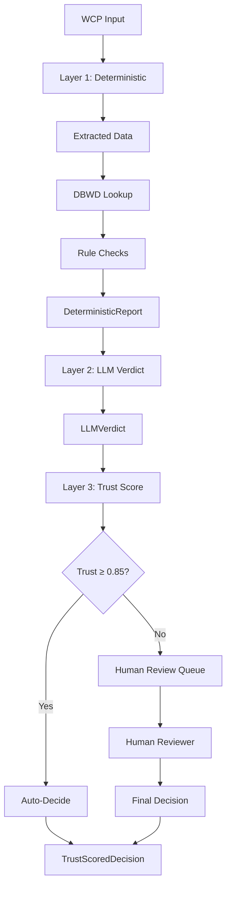

# Decision Pipeline

The three-layer decision pipeline for WCP compliance validation.

---

## Quick Start

### Run a Decision Through the Pipeline

```typescript
import { executeDecisionPipeline } from "./orchestrator.js";

const decision = await executeDecisionPipeline({
  content: "Role: Electrician, Hours: 40, Wage: 51.69",
});

console.log(decision.finalStatus); // "Approved" | "Revise" | "Reject" | "Pending Human Review"
console.log(decision.trust.score); // 0.0 - 1.0
console.log(decision.trust.band);  // "auto" | "flag_for_review" | "require_human"
```

### Run Tests

```bash
# All pipeline tests
npm run test:pipeline

# Specific test suites
npm run test:unit      # Schema and trust score tests
npm run test:integration  # End-to-end pipeline tests
npm run test:calibration  # Trust calibration with golden set

# Lint check
npm run lint:pipeline
```

---

## Architecture Overview



### Three Layers

| Layer | File | Responsibility | Output |
|-------|------|----------------|--------|
| **Layer 1** | `layer1-deterministic.ts` | Extract data, lookup DBWD, run checks | `DeterministicReport` |
| **Layer 2** | `layer2-llm-verdict.ts` | Reason over findings, decide status | `LLMVerdict` |
| **Layer 3** | `layer3-trust-score.ts` | Compute trust, apply thresholds | `TrustScoredDecision` |

**Orchestrator**: `orchestrator.ts` composes all three layers. This is the **only** valid entry point.

---

## Layer 1: Deterministic Scaffold

### What It Does

1. **Extract** structured data from WCP text (regex patterns)
2. **Resolve** worker classification (exact → alias → semantic → unknown)
3. **Lookup** DBWD prevailing wage rates
4. **Check** compliance rules:
   - Prevailing wage (40 U.S.C. § 3142)
   - Overtime 1.5× (40 U.S.C. § 3702)
   - Fringe benefits (29 CFR 5.22)
   - Classification (29 CFR 5.5)

### Key Functions

```typescript
// Main entry point
layer1Deterministic(input: string, traceId: string): Promise<DeterministicReport>

// Helper functions
extractWCPDataTool        // Structured data extraction
resolveClassification     // Hybrid classification
lookupDBWDRate           // DBWD rate lookup
checkPrevailingWage      // Wage validation
checkOvertime            // OT calculation validation
checkFringeBenefits      // Fringe validation
checkClassification      // Classification validation
```

### Example Output

```typescript
{
  traceId: "wcp-20240115-AB12",
  dbwdVersion: "2024-06-01",
  extracted: {
    role: "Electrician",
    hours: 40,
    wage: 45.00,  // Underpaid!
  },
  dbwdRate: {
    baseRate: 51.69,
    fringeRate: 34.63,
  },
  checks: [
    {
      id: "base_wage_001",
      type: "wage",
      passed: false,
      regulation: "40 U.S.C. § 3142(a)",
      expected: 51.69,
      actual: 45.00,
      difference: 6.69,
      severity: "critical",
      message: "UNDERPAYMENT: $6.69/hr shortfall",
    },
  ],
  classificationConfidence: 1.0,
  deterministicScore: 0.8,
}
```

---

## Layer 2: LLM Verdict

### What It Does

- Reviews the `DeterministicReport`
- Decides: **Approved** | **Revise** | **Reject**
- Provides human-readable rationale
- **MUST** reference check IDs from Layer 1
- **MUST NOT** recompute values

### Constraints (Enforced)

```typescript
// Prompt constraint
"You MUST NOT recompute wages, overtime, or fringe benefits.
You MUST NOT lookup DBWD rates yourself.
Use ONLY the findings in the provided DeterministicReport."

// Schema constraint
referencedCheckIds: string[] // Must be non-empty subset of report.checks[].id
```

### Example Output

```typescript
{
  traceId: "wcp-20240115-AB12",
  status: "Reject",
  rationale: "Worker is underpaid by $6.69/hr (40 U.S.C. § 3142 violation).",
  referencedCheckIds: ["base_wage_001"],
  citations: [
    { statute: "40 U.S.C. § 3142(a)", description: "Prevailing wage" }
  ],
  selfConfidence: 0.98,
  reasoningTrace: "Step 1: Found base_wage_001 check failed...",
  tokenUsage: 150,
  model: "gpt-4o-mini",
}
```

---

## Layer 3: Trust Score

### Trust Score Formula

```
trust = 0.35 × deterministicScore
      + 0.25 × classificationConfidence
      + 0.20 × llmSelfConfidence
      + 0.20 × agreementScore
```

| Component | Weight | Source |
|-----------|--------|--------|
| deterministic | 35% | Layer 1: fraction of clean checks |
| classification | 25% | Layer 1: match confidence (1.0/0.9/0.75/0.3) |
| llmSelf | 20% | Layer 2: model's self-reported confidence |
| agreement | 20% | Layer 3: verdict aligns with findings? |

### Thresholds

| Score | Band | Action |
|-------|------|--------|
| ≥0.85 | **auto** | Auto-decide, no human review |
| 0.60–0.84 | **flag_for_review** | Decide, but queue for optional review |
| <0.60 | **require_human** | Block auto-approval, require human review |

**Override**: Any LLM/deterministic disagreement forces `require_human`.

### Example Output

```typescript
{
  score: 0.45,
  components: {
    deterministic: 0.8,
    classification: 1.0,
    llmSelf: 0.98,
    agreement: 1.0,
  },
  band: "require_human", // Would be "auto" but disagreement override
  reasons: [
    "LLM verdict contradicts deterministic findings (agreement = 0)",
    "Trust score below 0.60 threshold"
  ],
}
```

---

## Human Review Queue

Low-trust decisions are automatically enqueued for human review.

```typescript
import { humanReviewQueue } from "../services/human-review-queue.js";

// Enqueue (called automatically by orchestrator)
await humanReviewQueue.enqueue(decision);

// List pending reviews
const pending = await humanReviewQueue.listPending();

// Submit review
await humanReviewQueue.submitReview(
  traceId,
  "override_to_approved", // or "Approved", "Revise", "Reject", "override_to_reject"
  "reviewer_001",
  "Wage exception applies - apprentice program"
);
```

---

## Testing

### Test Data

```typescript
import { validWCPs, violationWCPs, edgeCaseWCPs } from "../data/wcp-examples.js";

// Use in tests
for (const testCase of validWCPs) {
  const decision = await executeDecisionPipeline({ content: testCase.input });
  expect(decision.finalStatus).toBe(testCase.expectedStatus);
}
```

### Running Tests

```bash
# Pipeline-specific tests
npm run test:pipeline

# Full calibration with golden set
npm run test:calibration

# Watch mode
npm run test:watch
```

---

## Adding New Compliance Checks

To add a new check to Layer 1:

1. **Add check function** in `layer1-deterministic.ts`:

```typescript
function checkNewRule(
  extracted: ExtractedWCP,
  dbwdRate: DBWDRateInfo,
  checkId: number
): CheckResult {
  const passed = /* your logic */;
  
  return {
    id: `new_rule_${String(checkId).padStart(3, "0")}`,
    type: "new_type", // or existing type
    passed,
    regulation: "40 U.S.C. § XXXX", // Cite the statute
    expected: /* expected value */,
    actual: /* actual value */,
    severity: passed ? "info" : "error", // or "warning", "critical"
    message: passed ? "OK" : "Violation found",
  };
}
```

2. **Call from `layer1Deterministic`**:

```typescript
checks.push(checkNewRule(extracted, dbwdRate, checkId++));
```

3. **Update tests** in `tests/integration/decision-pipeline.test.ts`:

```typescript
it("catches new rule violations", async () => {
  const decision = await runPipeline("Role: X, Hours: 40, ...");
  const newCheck = decision.deterministic.checks.find(c => c.type === "new_type");
  expect(newCheck?.passed).toBe(false);
});
```

4. **Update ADR** if this is a significant architectural change.

---

## CI/CD Integration

The pipeline is enforced in CI via:

1. **Lint Check**: `npm run lint:pipeline` - AST analysis for architectural violations
2. **Unit Tests**: `npm run test:pipeline` - Fast, deterministic tests
3. **Calibration**: `npm run test:calibration` - Golden set evaluation (requires API key)

See `.github/workflows/pipeline-discipline.yml` for full CI configuration.

---

## File Reference

```
src/pipeline/
├── layer1-deterministic.ts    # Deterministic scaffold
├── layer2-llm-verdict.ts      # LLM reasoning layer
├── layer3-trust-score.ts      # Trust computation
├── orchestrator.ts            # Pipeline composer (main entry)
└── README.md                  # This file

tests/
├── data/
│   └── wcp-examples.ts        # Test case data
├── unit/
│   ├── pipeline-contracts.test.ts
│   └── trust-score.test.ts
├── integration/
│   └── decision-pipeline.test.ts
└── eval/
    └── trust-calibration.test.ts

scripts/
└── lint-pipeline-discipline.ts  # CI lint script
```

---

## Related Documentation

- [Decision Architecture Doctrine](../../docs/architecture/decision-architecture.md)
- [Trust Scoring System](../../docs/architecture/trust-scoring.md)
- [Human Review Workflow](../../docs/architecture/human-review-workflow.md)
- [ADR-005: Three-Layer Architecture](../../docs/adrs/ADR-005-decision-architecture.md)

---

## License

MIT - See root LICENSE
